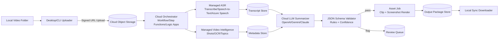
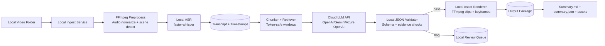
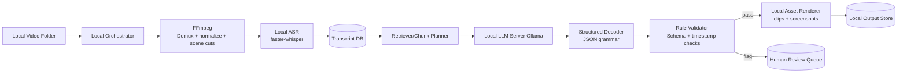
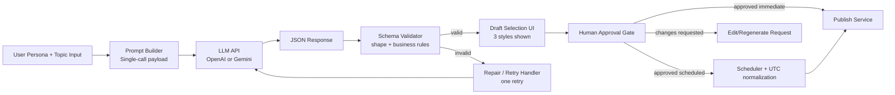
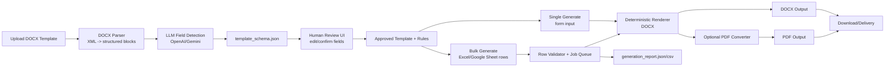
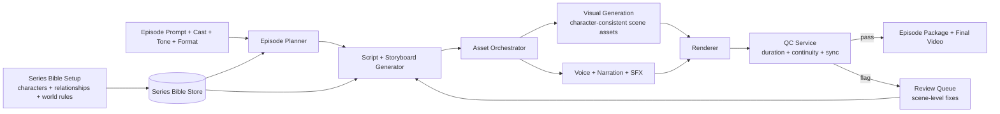

# GenAI Assignment:

**Evaluation Criteria**

We will score your submission on:

- Clarity and practicality of architecture
- Robust JSON schema design
- Prompt quality (zero-shot, reliable, minimal hallucination risk)
- Handling of ambiguity + user review flow
- Bulk generation thinking (errors, naming, report)

## Problem 1: **Proposal for “Video-to-Notes”**

We have a local folder of long videos (3–4 hours each, 200MB+). Watching them fully is slow. We need an automated way to generate a “summary package” per video: **Summary.md** + highlight clips + screenshots, all organized per video. [READ MORE ABOUT THE PROJECT](./Video-summary-platform.md)

### **Task**

Prepare a **pre-processed solution proposal** comparing **three approaches** **:**

1. **Online/Cloud-Based (Already Available Solutions)**
2. **Build Our Own Using LLM APIs (Hybrid: local media processing + cloud LLM)**
3. **Build Fully Offline Using Open-Source Models (Local transcription + local LLM + pipeline)**

No code required. We want a **clear, practical proposal** with architecture and tradeoffs.

### Your Solution for problem 1:

## Video-to-Notes: Pre-Processed Solution Proposal

### A) Shared Target Architecture (for all 3 approaches)

Each approach should produce the same deterministic output package per video:

- `Summary.md` (human-readable)
- `summary.json` (machine contract)
- `clips/` (timestamped highlights)
- `screenshots/` (timestamped keyframes)
- `run_log.json` (processing details + errors)

Core pipeline:

1. **Ingest + Media Preprocess**: scan folder, extract metadata, normalize audio, detect scenes/voice segments.
2. **Transcript Generation**: ASR/transcription (cloud/local depending on approach).
3. **Chunk + Summarize**: chunk transcript by token-safe windows; generate structured highlights + summary.
4. **Validation Layer**: schema validation + timestamp bounds + evidence checks.
5. **Asset Generation**: create clips/screenshots from approved timestamps.
6. **Review Queue**: send low-confidence/ambiguous items for human review.
7. **Batch Report**: success/fail counts, reasons, timing, output counts.

This gives **practicality, consistency, and easy migration** across approaches.

---

### B) Three Approaches (Detailed Analysis)

## 1) Online/Cloud-Based

**Already available cloud solutions**

- **ASR / transcript + timestamps**: `Google Cloud Speech-to-Text`, `AWS Transcribe`, `Azure AI Speech`.
- **Managed video analysis**: `Google Cloud Video Intelligence`, `AWS Rekognition Video`, `Azure Video Indexer` (shots, scenes, OCR, topics).
- **LLM summarization**: `OpenAI GPT-4.1/4o`, `Google Gemini 1.5/2.x`, `Azure OpenAI Service`, `Anthropic Claude`.
- **Pipeline orchestration**: `Google Workflows + Pub/Sub`, `AWS Step Functions + SQS`, `Azure Logic Apps + Service Bus`.
- **Storage + assets**: `GCS/S3/Azure Blob` with signed URLs for upload/download.

**Architecture diagram**



**Architecture description**

1. Upload the raw video once via pre-signed URL; avoid passing file bytes through app server.
2. Orchestrator creates an idempotent job (`job_id`, `video_id`, checksum) and fans out ASR + video-intelligence tasks.
3. Merge transcript timestamps with scene boundaries before prompting; this materially improves highlight grounding.
4. LLM step uses strict JSON mode and bounded chunk windows; include only transcript+metadata, no free-form context.
5. Validation service enforces schema, timestamp bounds, evidence presence, overlap thresholds, and confidence gates.
6. Asset worker generates clips/screenshots from validated timestamps and stores deterministic file names.
7. Review queue captures only flagged highlights for human correction; rerun is partial (per-highlight), not full-video.

**Pros and Cons**

| Pros                                                            | Cons                                                                            |
| --------------------------------------------------------------- | ------------------------------------------------------------------------------- |
| Fastest production-grade MVP with minimal infra ownership.      | Highest variable cost at scale (storage + ASR + LLM + egress).                  |
| Strong multilingual ASR and diarization quality out of the box. | Strongest data-governance constraints (video/transcript exits local perimeter). |
| Built-in scalability and managed reliability.                   | Tight coupling to provider APIs and quota behavior.                             |

**Best fit**: Rapid pilot where time-to-market matters most.

---

## 2) Hybrid: Local Media Processing + Cloud LLM APIs

**Stack options**

- **Local media + ASR**: `FFmpeg` + `faster-whisper` (or `whisper.cpp`) for transcript generation.
- **Cloud LLM only**: `OpenAI Responses API`, `Google Gemini API`, or `Azure OpenAI` for summarization.
- **Local orchestration**: `Python worker + Redis/RQ` or `Temporal` (self-hosted).
- **Local data stores**: `PostgreSQL/SQLite` for jobs + `MinIO/local disk` for artifacts.

**Architecture diagram**



**Architecture description**

1. Keep raw media, preprocessed audio, and generated assets strictly local to reduce privacy exposure.
2. Send only compressed transcript chunks + metadata to cloud LLM; never upload raw video frames.
3. Use deterministic chunk boundaries (`max_tokens`, overlap, speaker/scene anchors) for reproducible runs.
4. Enforce structured output (`summary.json`) via strict schema validation plus single repair pass.
5. Perform all timestamp-sensitive operations locally (clip cutting, screenshot extraction) to prevent drift.
6. Persist intermediate artifacts so retries start from the failed stage, not from ingest.
7. Add confidence thresholds by highlight/evidence density to drive review queue intelligently.

**Pros and Cons**

| Pros                                                              | Cons                                                               |
| ----------------------------------------------------------------- | ------------------------------------------------------------------ |
| Best balance of quality, privacy, and delivery speed.             | Requires disciplined local orchestration and retry design.         |
| No raw-video cloud transfer; lower compliance risk vs full cloud. | External LLM availability and token pricing still affect SLO/cost. |

**Best fit**: Production-ready default for most teams.

---

## 3) Fully Offline: Open-Source ASR + Local LLM + Local Pipeline

**Open-source stack**

- **ASR**: `faster-whisper` (CUDA/CPU variants).
- **Local LLM serving**: `vLLM` or `Ollama` with models such as `Llama 3.1/3.3`, `Qwen2.5`, `Mistral`.
- **Orchestration + scheduling**: `Temporal`, `Airflow`, or Python queue workers.

**Detailed architecture diagram**



**Architecture description**

1. Deploy the pipeline on a controlled host (workstation or on-prem GPU node) with pinned model versions.
2. Use quantized LLM variants for throughput and memory fit; keep a higher-quality fallback model for low-confidence jobs.
3. Constrain generation with JSON grammar/structured decoder to minimize malformed output.
4. Add retrieval over transcript segments for long videos so prompt context stays focused and token-efficient.
5. Implement hardware-aware scheduling (GPU memory guards, per-job concurrency caps, thermal-safe batching).
6. Track model/prompt versions in output metadata to preserve reproducibility for audits.
7. Keep human review loop identical to other approaches so migration between stacks stays low risk.

**Pros and Cons**

| Pros                                                        | Cons                                                                          |
| ----------------------------------------------------------- | ----------------------------------------------------------------------------- |
| Maximum privacy and full control over data/model lifecycle. | Highest MLOps complexity (model upgrades, quantization, serving, monitoring). |
| No third-party API outage dependency.                       | Requires GPU capacity planning and strong observability.                      |
| Predictable unit economics after infra amortization.        | Quality/latency vary significantly by model/hardware profile.                 |

**Best fit**: Compliance-sensitive or data-residency-heavy environments.

### C) Final Comparison Table (Across 3 Approaches)

**Sample constraints from the question (and how each approach fits):**

| Constraint                                                             | Online/Cloud-Based                                                             | Hybrid (Local media + Cloud LLM)                                           | Fully Offline (Open-source local)                                           |
| ---------------------------------------------------------------------- | ------------------------------------------------------------------------------ | -------------------------------------------------------------------------- | --------------------------------------------------------------------------- |
| Local folder of long videos (3–4 hours, 200MB+)                        | Handles scale well, but needs upload of each large file to cloud storage.      | Keeps heavy media processing local; only transcript chunks go to cloud.    | Entire pipeline stays local; best fit for large local files without upload. |
| Output package per video: `Summary.md` + highlight clips + screenshots | Easy to orchestrate in cloud workers; strong scalability for asset generation. | Deterministic local FFmpeg rendering gives stable clip/screenshot quality. | Fully local rendering works, but depends on local compute throughput.       |
| Keep videos organized per video/job                                    | Strong with managed object storage and workflow IDs.                           | Strong with local job store + deterministic folder naming.                 | Strong with local orchestrator and versioned local output store.            |
| Practical delivery with clear tradeoffs (no-code proposal context)     | Fastest MVP and easiest to explain operationally.                              | Best balance of practicality, privacy, and quality (recommended).          | Most control, but highest implementation/ops complexity.                    |
| Data sensitivity from local video source                               | Lowest privacy fit (raw media/transcripts leave local boundary).               | Better privacy fit (raw video stays local).                                | Highest privacy fit (no external API dependency).                           |

---

### D) Robust JSON Schema Design (Contract First)

Use one canonical `summary.json` schema for all approaches.

**Canonical schema (`summary.schema.json`)**

<details>
<summary>Expand <code>summary.schema.json</code></summary>

```json
{
  "$schema": "https://json-schema.org/draft/2020-12/schema",
  "$id": "https://example.local/schemas/summary.schema.json",
  "title": "Video Summary Package",
  "type": "object",
  "additionalProperties": false,
  "required": [
    "video",
    "processing",
    "summary",
    "highlights",
    "assets",
    "quality",
    "review"
  ],
  "properties": {
    "video": {
      "type": "object",
      "additionalProperties": false,
      "required": [
        "id",
        "filename",
        "duration_sec",
        "language",
        "processed_at"
      ],
      "properties": {
        "id": { "type": "string", "minLength": 1 },
        "filename": { "type": "string", "minLength": 1 },
        "duration_sec": { "type": "number", "exclusiveMinimum": 0 },
        "language": { "type": "string", "minLength": 2 },
        "processed_at": { "type": "string", "format": "date-time" }
      }
    },
    "processing": {
      "type": "object",
      "additionalProperties": false,
      "required": [
        "pipeline_version",
        "transcript_source",
        "summary_model",
        "runtime_sec",
        "token_usage"
      ],
      "properties": {
        "pipeline_version": { "type": "string", "minLength": 1 },
        "transcript_source": {
          "type": "string",
          "enum": ["cloud_asr", "faster_whisper", "whisper_cpp", "manual"]
        },
        "summary_model": { "type": "string", "minLength": 1 },
        "runtime_sec": { "type": "number", "minimum": 0 },
        "token_usage": {
          "type": "object",
          "additionalProperties": false,
          "required": ["input", "output", "total"],
          "properties": {
            "input": { "type": "integer", "minimum": 0 },
            "output": { "type": "integer", "minimum": 0 },
            "total": { "type": "integer", "minimum": 0 }
          }
        }
      }
    },
    "summary": {
      "type": "object",
      "additionalProperties": false,
      "required": ["overview", "key_takeaways", "action_items"],
      "properties": {
        "overview": { "type": "string", "minLength": 20 },
        "key_takeaways": {
          "type": "array",
          "minItems": 3,
          "items": { "type": "string", "minLength": 5 }
        },
        "action_items": {
          "type": "array",
          "items": { "type": "string", "minLength": 5 }
        }
      }
    },
    "highlights": {
      "type": "array",
      "minItems": 1,
      "items": {
        "type": "object",
        "additionalProperties": false,
        "required": [
          "id",
          "title",
          "start_sec",
          "end_sec",
          "summary_point",
          "evidence_quotes",
          "confidence",
          "needs_review"
        ],
        "properties": {
          "id": { "type": "string", "pattern": "^h_[0-9]{2,}$" },
          "title": { "type": "string", "minLength": 5 },
          "start_sec": { "type": "number", "minimum": 0 },
          "end_sec": { "type": "number", "minimum": 0 },
          "summary_point": { "type": "string", "minLength": 10 },
          "evidence_quotes": {
            "type": "array",
            "minItems": 1,
            "items": {
              "type": "object",
              "additionalProperties": false,
              "required": ["quote", "source_start_sec", "source_end_sec"],
              "properties": {
                "quote": { "type": "string", "minLength": 5 },
                "source_start_sec": { "type": "number", "minimum": 0 },
                "source_end_sec": { "type": "number", "minimum": 0 }
              }
            }
          },
          "confidence": { "type": "number", "minimum": 0, "maximum": 1 },
          "needs_review": { "type": "boolean" },
          "review_reason": { "type": "string", "minLength": 5 }
        },
        "allOf": [
          {
            "if": { "properties": { "needs_review": { "const": true } } },
            "then": { "required": ["review_reason"] }
          }
        ]
      }
    },
    "assets": {
      "type": "object",
      "additionalProperties": false,
      "required": ["clips", "screenshots"],
      "properties": {
        "clips": {
          "type": "array",
          "items": {
            "type": "object",
            "additionalProperties": false,
            "required": ["highlight_id", "path"],
            "properties": {
              "highlight_id": { "type": "string", "pattern": "^h_[0-9]{2,}$" },
              "path": { "type": "string", "minLength": 1 }
            }
          }
        },
        "screenshots": {
          "type": "array",
          "items": {
            "type": "object",
            "additionalProperties": false,
            "required": ["highlight_id", "path"],
            "properties": {
              "highlight_id": { "type": "string", "pattern": "^h_[0-9]{2,}$" },
              "path": { "type": "string", "minLength": 1 }
            }
          }
        }
      }
    },
    "quality": {
      "type": "object",
      "additionalProperties": false,
      "required": [
        "schema_valid",
        "timestamp_alignment_passed",
        "coverage_score"
      ],
      "properties": {
        "schema_valid": { "type": "boolean" },
        "timestamp_alignment_passed": { "type": "boolean" },
        "coverage_score": { "type": "number", "minimum": 0, "maximum": 1 }
      }
    },
    "review": {
      "type": "object",
      "additionalProperties": false,
      "required": ["required", "items"],
      "properties": {
        "required": { "type": "boolean" },
        "items": {
          "type": "array",
          "items": {
            "type": "object",
            "additionalProperties": false,
            "required": ["highlight_id", "reason"],
            "properties": {
              "highlight_id": { "type": "string", "pattern": "^h_[0-9]{2,}$" },
              "reason": { "type": "string", "minLength": 5 }
            }
          }
        }
      }
    }
  }
}
```

</details>

**Minimal valid `summary.json` example**

```json
{
  "video": {
    "id": "vid_001",
    "filename": "genai_masterclass.mp4",
    "duration_sec": 12600,
    "language": "en",
    "processed_at": "2026-02-20T09:00:00Z"
  },
  "processing": {
    "pipeline_version": "v1.2.0",
    "transcript_source": "faster_whisper",
    "summary_model": "gpt-4.1-mini",
    "runtime_sec": 740,
    "token_usage": {
      "input": 50210,
      "output": 2810,
      "total": 53020
    }
  },
  "summary": {
    "overview": "Session explains practical LLM system design, focusing on retrieval, evaluation loops, and deployment tradeoffs.",
    "key_takeaways": [
      "Ground outputs with timestamped transcript evidence.",
      "Use schema validation before rendering final assets.",
      "Route low-confidence highlights to human review."
    ],
    "action_items": [
      "Implement confidence threshold at 0.70.",
      "Add retry logic for transient transcription failures."
    ]
  },
  "highlights": [
    {
      "id": "h_01",
      "title": "Why evidence-grounded highlights matter",
      "start_sec": 810,
      "end_sec": 930,
      "summary_point": "Speaker shows that summaries without evidence increase hallucination risk in long-form video notes.",
      "evidence_quotes": [
        {
          "quote": "If we cannot trace a claim to transcript time, it is not production-safe.",
          "source_start_sec": 845,
          "source_end_sec": 858
        }
      ],
      "confidence": 0.88,
      "needs_review": false
    }
  ],
  "assets": {
    "clips": [
      {
        "highlight_id": "h_01",
        "path": "clips/h_01_810-930.mp4"
      }
    ],
    "screenshots": [
      {
        "highlight_id": "h_01",
        "path": "screenshots/h_01_845.jpg"
      }
    ]
  },
  "quality": {
    "schema_valid": true,
    "timestamp_alignment_passed": true,
    "coverage_score": 0.91
  },
  "review": {
    "required": false,
    "items": []
  }
}
```

**Runtime validation rules (outside schema)**

- Ensure `start_sec < end_sec` and `end_sec <= video.duration_sec` for every highlight.
- Ensure all evidence timestamp spans are valid and bounded by video duration.
- Ensure every asset `highlight_id` exists in `highlights[].id`.
- If `review.required=true`, keep at least one item in `review.items`.

This contract-first design minimizes hallucination and keeps the pipeline deterministic and auditable.

---

### E) Prompt Quality (Zero-Shot, Reliable, Low Hallucination)

Use strict, single-call zero-shot prompting with explicit constraints.

**System instruction essentials**:

1. Return **valid JSON only** matching provided schema.
2. Do **not invent facts** beyond transcript chunks.
3. Every highlight must include evidence quote(s) + source timestamps.
4. Mark ambiguous/weak items with `needs_review=true` and reason.
5. Keep summary concise and readable (5–10 minute read).

**User payload should include**:

- video metadata,
- transcript chunks with timestamps/speaker tags,
- required highlight range (e.g., 6–12),
- schema excerpt.

**Reliability controls**:

- schema-constrained decoding / JSON mode,
- post-validation,
- one repair retry prompt for invalid JSON or broken constraints.

---

### F) Ambiguity Handling + User Review Flow

Trigger review when:

- low confidence,
- missing/weak evidence,
- contradictory transcript signals,
- overlapping highlights,
- poor audio/silent sections.

Flow:

1. Generate JSON.
2. Run validations + confidence checks.
3. If pass → render final package.
4. If flagged → add to `review_queue.json`.
5. Human edits only affected highlights/timestamps.
6. Regenerate only impacted clips/screenshots (partial rerun).

This keeps human effort focused and reduces full reruns.

---

### G) Bulk Generation Thinking (Errors, Naming, Reports)

**Batch model**

- Folder scan → immutable job id per video.
- Bounded concurrency to avoid CPU/GPU overload.
- Save intermediates (transcript, draft JSON) for restartability.

**Naming convention**

- `<video_slug>/Summary.md`
- `<video_slug>/summary.json`
- `<video_slug>/clips/h_<NN>_<start>-<end>.mp4`
- `<video_slug>/screenshots/h_<NN>_<timestamp>.jpg`
- `<video_slug>/run_log.json`
- global: `reports/batch_report.json`, `reports/review_queue.json`

**Error strategy**

- classify: `transcription_error`, `llm_error`, `schema_error`, `asset_error`, `io_error`
- retry transient errors with backoff
- single repair retry for schema errors
- fail fast for deterministic media corruption
- never block full batch on one failed video

**Run report fields**

- total/success/partial/fail counts
- average runtime per video
- number of highlights/clips/screenshots generated
- top failure reasons
- review-required counts

---

## Problem 2: **Zero-Shot Prompt to generate 3 LinkedIn Post**

Design a **single zero-shot prompt** that takes a user’s persona configuration + a topic and generates **3 LinkedIn post drafts** in **3 distinct styles**, each aligned to the user’s voice and constraints. The output must be structured so the app can: show 3 drafts to the user. Assume we are consuming **OpenAI API / Gemini API** with **one prompt call** (no fine-tuning). Your prompt must reliably produce valid, structured output. [READ MORE ABOUT THE PROJECT](./linkedin-automation.md)

**TASK:** Write a prompt that can work.

### Your Solution for problem 2:

## Single Zero-Shot Prompt (One Call, 3 Drafts, Structured Output)

For this problem, the goal is simple: one API call should return three usable drafts that feel like the same person wrote them, while still being clearly different in style. Also treating safety and reviewability as first-class requirements, not optional extras.

Use this prompt at runtime (replace placeholders in `INPUT_JSON`):

```text
You are writing LinkedIn drafts for a real user profile.

Goal:
From one persona config + one topic, generate exactly 3 draft posts in 3 different styles, while keeping a consistent voice.

Non-negotiable rules:
1) Return valid JSON only. No markdown, no extra commentary.
2) Follow the schema exactly.
3) Respect persona instructions: tone, do/don't rules, banned phrases, and compliance notes.
4) Never invent achievements, numbers, employers, certifications, or case studies not present in input.
5) Keep all drafts useful and publishable, but clearly different from each other.
6) Include an approval gate: publishing is never automatic without human approval.
7) If input is incomplete or ambiguous, still provide best-effort drafts and mark needs_review=true with clear notes.

Use each style exactly once:
- Concise Insight: short, sharp professional takeaway
- Story-Based: brief narrative + practical lesson
- Actionable Checklist: step-by-step practical guidance + CTA

Writing limits:
- Each draft body: 120-220 words
- Hook: max 18 words
- Max hashtags: 6
- CTA: one line

Output schema:
{
  "request_id": "string",
  "input_echo": {
    "topic": "string",
    "target_audience": "string",
    "goal": "string",
    "posting_preference": {
      "mode": "immediate|scheduled",
      "scheduled_local_datetime": "string|null",
      "timezone": "string|null",
      "scheduled_utc": "string|null"
    }
  },
  "persona_alignment": {
    "voice_summary": "string",
    "applied_rules": ["string"],
    "risk_flags": ["string"]
  },
  "drafts": [
    {
      "draft_id": "d1|d2|d3",
      "style": "Concise Insight|Story-Based|Actionable Checklist",
      "title": "string",
      "hook": "string",
      "body": "string",
      "cta": "string",
      "hashtags": ["string"],
      "style_differentiator": "string",
      "compliance_checks": {
        "no_invented_claims": true,
        "no_banned_phrases": true,
        "policy_safe": true
      },
      "quality_score": 0.0,
      "needs_review": false,
      "review_notes": ["string"]
    }
  ],
  "selection_and_publish": {
    "approval_required": true,
    "recommended_draft_id": "d1|d2|d3",
    "recommendation_reason": "string",
    "publish_plan": {
      "mode": "immediate|scheduled",
      "scheduled_local_datetime": "string|null",
      "timezone": "string|null",
      "scheduled_utc": "string|null",
      "pre_publish_checklist": [
        "persona_match",
        "final_human_approval",
        "linkedin_policy_check"
      ]
    }
  },
  "errors": [
    {
      "code": "missing_input|ambiguity|policy_risk",
      "message": "string",
      "field": "string"
    }
  ]
}

Validation constraints:
- drafts must have exactly 3 entries with no duplicate style
- if mode is scheduled, timezone is mandatory
- if scheduled_local_datetime is provided, also return scheduled_utc when conversion is possible
- quality_score must be 0 to 1
- if ambiguity exists, set needs_review=true on affected drafts and add matching errors[] items

Now process INPUT_JSON and return JSON only.

INPUT_JSON:
{
  "request_id": "{{request_id}}",
  "persona": {
    "background": "{{background}}",
    "experience_level": "{{experience_level}}",
    "tone": "{{tone}}",
    "language_style": "{{language_style}}",
    "dos": ["{{do_1}}", "{{do_2}}"],
    "donts": ["{{dont_1}}", "{{dont_2}}"],
    "banned_phrases": ["{{phrase_1}}", "{{phrase_2}}"],
    "allowed_claims": ["{{claim_1}}", "{{claim_2}}"]
  },
  "content_input": {
    "topic": "{{topic}}",
    "optional_context": "{{optional_context}}",
    "target_audience": "{{target_audience}}",
    "goal": "{{goal}}"
  },
  "posting_preference": {
    "mode": "{{immediate_or_scheduled}}",
    "scheduled_local_datetime": "{{yyyy-mm-ddThh:mm}}",
    "timezone": "{{IANA_timezone}}"
  }
}
```

### Architecture Diagram



This diagram reflects why the solution is reliable in production: one deterministic generation call, strict validation before UI exposure, and a hard human-approval gate before any publish action.

### Input JSON Schema (What the model receives)

This input is designed to give the model just enough context to write high-quality drafts without opening room for hallucination.

- `request_id`: Trace id for logging/debugging this single generation request.
- `persona`: Core voice control block.
  - `background`: Who the user is (domain, role context).
  - `experience_level`: Seniority signal to calibrate confidence/complexity.
  - `tone`: Communication mood (e.g., direct, warm, analytical).
  - `language_style`: Writing texture (simple, technical, conversational).
  - `dos[]`: Positive guardrails (what to include).
  - `donts[]`: Negative guardrails (what to avoid).
  - `banned_phrases[]`: Hard exclusions for brand/compliance consistency.
  - `allowed_claims[]`: Claims that are explicitly safe to use.
- `content_input`: Topic-level instructions for this run.
  - `topic`: Main subject of all 3 drafts.
  - `optional_context`: Extra details/examples if available.
  - `target_audience`: Who the post is meant for.
  - `goal`: Why this post is being written (engagement, leads, authority, etc.).
- `posting_preference`: Publishing intent.
  - `mode`: `immediate` or `scheduled`.
  - `scheduled_local_datetime`: Local publish time if scheduled.
  - `timezone`: IANA timezone string for reliable UTC normalization.

Why this structure works: persona rules control voice, content_input controls relevance, and posting_preference controls publish behavior—clean separation reduces ambiguity.

### Output JSON Schema (What the app receives)

The output schema is shaped for direct UI rendering + safe publish workflow in one response.

- `request_id`: Echo for request-response correlation.
- `input_echo`: Normalized key inputs used by the model (audit/debug visibility).
- `persona_alignment`: Explainability block.
  - `voice_summary`: Short summary of interpreted persona voice.
  - `applied_rules[]`: Which persona constraints were applied.
  - `risk_flags[]`: Potential risks detected (claim risk, policy tone, ambiguity).
- `drafts[]`: Exactly 3 generated post options.
  - `draft_id`: Stable selector for UI actions.
  - `style`: One of the required styles, no duplicates.
  - `title`, `hook`, `body`, `cta`, `hashtags[]`: Render-ready content fields.
  - `style_differentiator`: One-line explanation of what makes this draft distinct.
  - `compliance_checks`: Boolean self-checks for key safety constraints.
  - `quality_score`: Relative draft quality estimate in range 0-1.
  - `needs_review` + `review_notes[]`: Per-draft review signal for uncertain cases.
- `selection_and_publish`: Operational handoff block.
  - `approval_required`: Always true to enforce human-in-the-loop publishing.
  - `recommended_draft_id`: Best candidate for default selection.
  - `recommendation_reason`: Why that draft is preferred.
  - `publish_plan`: Final mode/timing + pre-publish checklist.
- `errors[]`: Structured error channel.
  - `code`: Machine-friendly type (`missing_input`, `ambiguity`, `policy_risk`).
  - `message`: Human-readable description.
  - `field`: Input field linked to the issue.

Why this structure works: content generation, explainability, risk signaling, and publish controls are all returned together, so the frontend can render drafts and enforce safe approval flow without additional model calls.

### Why this works in practice

- It gives clean, app-friendly JSON in one shot (no post-processing gymnastics).
- It balances creativity with guardrails, so drafts stay distinct without drifting from persona.
- It prevents fake claims and forces explicit review flags when data is weak.
- It supports real publishing flow: recommendation + mandatory human approval + schedule normalization.

## Problem 3: **Smart DOCX Template → Bulk DOCX/PDF Generator (Proposal + Prompt)**

Users have many Word documents that act like templates (offer letters, certificates, invoices, contracts). They repeatedly change only a few fields (name, date, amount, address, role, etc.). Doing this manually is slow and error-prone, especially in bulk. [READ MORE ABOUT THE PROJECT](./docs-template-output-generation.md)

We want a system that:

1. Converts an uploaded **DOCX** into a reusable **template** by identifying editable fields.
2. Supports **single generation** (form-fill → DOCX/PDF download).
3. Supports **bulk generation** via **Excel/Google Sheet** rows.

### **Task (No coding)**

Submit a **proposal** for building this system using GenAI (OpenAI/Gemini) for “template field detection” and “field schema generation”. We want a practical design, not code.

### Your Solution for problem 3:

## Smart DOCX Template → Bulk DOCX/PDF Generator (Proposal + Prompt)

### A) Practical Architecture (LLM only for field detection + schema)

Use a **hybrid deterministic pipeline**: GenAI for understanding template intent, rule-based engine for rendering reliability.

1. **Template Ingestion**
   - Upload DOCX (or pick existing template).
   - Parse document XML into structured blocks (paragraphs, tables, headers/footers, runs).
2. **AI Field Detection + Schema Draft**
   - Send normalized text + layout metadata (not binary file) to LLM.
   - LLM returns `template_schema.json` with candidate fields, types, constraints, and confidence.
3. **Human Review + Save Template**
   - UI shows detected fields and anchor snippets.
   - User renames/merges/splits fields, marks optional blocks, confirms required fields.
4. **Rendering Engine (Deterministic)**
   - Single mode: form input → DOCX render → optional PDF conversion.
   - Bulk mode: Excel/Google Sheet rows → per-row validation → render outputs.
5. **Job Orchestrator + Reporting**
   - Queue-based execution, retries for transient failures.
   - Per-row status, downloadable ZIP, `generation_report.json/csv`.

**Architecture Diagram**



Why this is practical: document rendering is deterministic (low risk), while LLM is scoped only to field discovery and schema generation where it adds the most value.

---

### B) Core JSON Contracts

Use two contracts: **template schema** and **generation job schema**.

## 1) `template_schema.json`

<details>
<summary>Expand <code>template_schema.json</code></summary>

```json
{
  "$schema": "https://json-schema.org/draft/2020-12/schema",
  "title": "DocTemplateSchema",
  "type": "object",
  "required": ["template", "fields", "rules", "review"],
  "properties": {
    "template": {
      "type": "object",
      "required": [
        "template_id",
        "template_name",
        "version",
        "source_filename"
      ],
      "properties": {
        "template_id": { "type": "string" },
        "template_name": { "type": "string" },
        "version": { "type": "integer", "minimum": 1 },
        "source_filename": { "type": "string" },
        "created_at_utc": { "type": "string", "format": "date-time" }
      }
    },
    "fields": {
      "type": "array",
      "minItems": 1,
      "items": {
        "type": "object",
        "required": [
          "field_key",
          "label",
          "type",
          "required",
          "anchors",
          "confidence"
        ],
        "properties": {
          "field_key": { "type": "string", "pattern": "^[a-z0-9_]+$" },
          "label": { "type": "string" },
          "type": {
            "type": "string",
            "enum": [
              "text",
              "number",
              "date",
              "currency",
              "email",
              "phone",
              "boolean"
            ]
          },
          "required": { "type": "boolean" },
          "default_value": {},
          "format": { "type": "string" },
          "enum_values": {
            "type": "array",
            "items": { "type": "string" }
          },
          "anchors": {
            "type": "array",
            "minItems": 1,
            "items": {
              "type": "object",
              "required": ["section", "snippet"],
              "properties": {
                "section": {
                  "type": "string",
                  "enum": ["body", "table", "header", "footer"]
                },
                "snippet": { "type": "string" }
              }
            }
          },
          "confidence": { "type": "number", "minimum": 0, "maximum": 1 },
          "needs_review": { "type": "boolean", "default": false },
          "review_reason": { "type": "string" }
        },
        "allOf": [
          {
            "if": { "properties": { "needs_review": { "const": true } } },
            "then": { "required": ["review_reason"] }
          }
        ]
      }
    },
    "rules": {
      "type": "object",
      "required": ["filename_pattern", "output_formats"],
      "properties": {
        "filename_pattern": { "type": "string" },
        "output_formats": {
          "type": "array",
          "items": { "type": "string", "enum": ["docx", "pdf"] },
          "minItems": 1
        },
        "optional_blocks": {
          "type": "array",
          "items": {
            "type": "object",
            "required": ["block_id", "condition_field_key"],
            "properties": {
              "block_id": { "type": "string" },
              "condition_field_key": { "type": "string" }
            }
          }
        }
      }
    },
    "review": {
      "type": "object",
      "required": ["required", "items"],
      "properties": {
        "required": { "type": "boolean" },
        "items": {
          "type": "array",
          "items": {
            "type": "object",
            "required": ["type", "message"],
            "properties": {
              "type": {
                "type": "string",
                "enum": [
                  "ambiguous_field",
                  "low_confidence",
                  "type_conflict",
                  "other"
                ]
              },
              "message": { "type": "string" }
            }
          }
        }
      }
    }
  }
}
```

</details>

**Minimal valid `template_schema.json` example**

```json
{
  "template": {
    "template_id": "tmpl_offer_letter_v1",
    "template_name": "Offer Letter",
    "version": 1,
    "source_filename": "offer_letter_template.docx",
    "created_at_utc": "2026-02-20T10:00:00Z"
  },
  "fields": [
    {
      "field_key": "candidate_name",
      "label": "Candidate Name",
      "type": "text",
      "required": true,
      "anchors": [
        {
          "section": "body",
          "snippet": "Dear [Candidate Name],"
        }
      ],
      "confidence": 0.94,
      "needs_review": false
    }
  ],
  "rules": {
    "filename_pattern": "{{candidate_name}}_OfferLetter_{{date}}",
    "output_formats": ["docx", "pdf"],
    "optional_blocks": []
  },
  "review": {
    "required": false,
    "items": []
  }
}
```

## 2) `generation_job.schema.json`

<details>
<summary>Expand <code>generation_job.schema.json</code></summary>

```json
{
  "$schema": "https://json-schema.org/draft/2020-12/schema",
  "title": "GenerationJobSchema",
  "type": "object",
  "additionalProperties": false,
  "required": [
    "job_id",
    "template_id",
    "source",
    "requested_formats",
    "rows",
    "summary"
  ],
  "properties": {
    "job_id": { "type": "string", "minLength": 1 },
    "template_id": { "type": "string", "minLength": 1 },
    "source": {
      "type": "string",
      "enum": ["single", "excel", "google_sheet"]
    },
    "requested_formats": {
      "type": "array",
      "minItems": 1,
      "items": { "type": "string", "enum": ["docx", "pdf"] }
    },
    "rows": {
      "type": "array",
      "minItems": 1,
      "items": {
        "type": "object",
        "additionalProperties": false,
        "required": ["row_id", "input", "validation", "output"],
        "properties": {
          "row_id": { "type": "string", "minLength": 1 },
          "input": {
            "type": "object",
            "description": "key-value mapping where keys are field_key values from template schema",
            "additionalProperties": {
              "oneOf": [
                { "type": "string" },
                { "type": "number" },
                { "type": "integer" },
                { "type": "boolean" },
                { "type": "null" }
              ]
            }
          },
          "validation": {
            "type": "object",
            "additionalProperties": false,
            "required": ["status", "errors", "warnings"],
            "properties": {
              "status": {
                "type": "string",
                "enum": ["pass", "fail", "warning"]
              },
              "errors": {
                "type": "array",
                "items": { "type": "string" }
              },
              "warnings": {
                "type": "array",
                "items": { "type": "string" }
              }
            }
          },
          "output": {
            "type": "object",
            "additionalProperties": false,
            "required": [
              "status",
              "docx_path",
              "pdf_path",
              "file_name",
              "error_code",
              "error_message"
            ],
            "properties": {
              "status": {
                "type": "string",
                "enum": ["generated", "failed", "skipped"]
              },
              "docx_path": { "type": ["string", "null"] },
              "pdf_path": { "type": ["string", "null"] },
              "file_name": { "type": ["string", "null"] },
              "error_code": { "type": ["string", "null"] },
              "error_message": { "type": ["string", "null"] }
            }
          }
        }
      }
    },
    "summary": {
      "type": "object",
      "additionalProperties": false,
      "required": [
        "total_rows",
        "generated",
        "failed",
        "warnings",
        "started_at_utc",
        "completed_at_utc"
      ],
      "properties": {
        "total_rows": { "type": "integer", "minimum": 0 },
        "generated": { "type": "integer", "minimum": 0 },
        "failed": { "type": "integer", "minimum": 0 },
        "warnings": { "type": "integer", "minimum": 0 },
        "started_at_utc": { "type": "string", "format": "date-time" },
        "completed_at_utc": { "type": "string", "format": "date-time" }
      }
    }
  }
}
```

</details>

**Minimal valid `generation_job.json` example**

```json
{
  "job_id": "job_20260220_001",
  "template_id": "tmpl_offer_letter_v1",
  "source": "excel",
  "requested_formats": ["docx", "pdf"],
  "rows": [
    {
      "row_id": "row_001",
      "input": {
        "candidate_name": "Aarav Singh",
        "joining_date": "2026-03-10",
        "salary": 1200000
      },
      "validation": {
        "status": "pass",
        "errors": [],
        "warnings": []
      },
      "output": {
        "status": "generated",
        "docx_path": "outputs/job_20260220_001/row_001.docx",
        "pdf_path": "outputs/job_20260220_001/row_001.pdf",
        "file_name": "AaravSingh_OfferLetter_2026-03-10_row_001",
        "error_code": null,
        "error_message": null
      }
    }
  ],
  "summary": {
    "total_rows": 1,
    "generated": 1,
    "failed": 0,
    "warnings": 0,
    "started_at_utc": "2026-02-20T10:15:00Z",
    "completed_at_utc": "2026-02-20T10:16:20Z"
  }
}
```

---

### C) Zero-Shot Prompt (for field detection + schema generation)

Use this single prompt for template analysis:

```text
You are a document-template analysis engine.

Task:
Analyze the provided DOCX extracted structure and return ONLY valid JSON that matches the required schema.

Rules:
1) Output JSON only. No markdown.
2) Detect editable fields that are likely variable across document instances.
3) Infer field types conservatively (text if unsure).
4) Never invent fields that are not supported by visible evidence.
5) For each field, include at least one anchor snippet from source text.
6) If confidence < 0.70 or ambiguity exists, set needs_review=true and provide review_reason.
7) Suggest practical filename_pattern using available fields.
8) Preserve original document intent; do not rewrite content.

Return schema shape:
- template (id/name/version/source)
- fields[] with field_key, label, type, required, format/enum (if any), anchors[], confidence, needs_review/review_reason
- rules (filename_pattern, output_formats, optional_blocks)
- review (required + review items)

Validation constraints:
- field_key must be snake_case lowercase.
- no duplicate field_key.
- each field must have anchors[].
- if needs_review=true then review_reason is required.

INPUT:
{
	"template_id": "{{template_id}}",
	"template_name": "{{template_name}}",
	"source_filename": "{{source_filename}}",
	"doc_structure": {
		"paragraphs": ["..."],
		"tables": [{"cells": ["..."]}],
		"headers": ["..."],
		"footers": ["..."]
	},
	"preferred_output_formats": ["docx", "pdf"]
}
```

Why reliable: strict JSON-only output, evidence anchors, conservative typing, and explicit ambiguity flags reduce hallucination risk.

---

### D) Ambiguity Handling + User Review Flow

Ambiguity examples:

- Same label appears in multiple places with different meanings (`date` in offer date vs joining date).
- Conflicting type hints (`amount` appears as plain number in one section and currency in another).
- Optional clause blocks (e.g., relocation allowance paragraph) without clear trigger field.

Review flow:

1. LLM returns schema with confidence + review flags.
2. UI highlights anchors in preview and asks user to confirm edits.
3. System saves **versioned template schema** only after approval.
4. For generation failures, user can fix only impacted rows and re-run partial job.

---

### E) Bulk Generation Strategy (Errors, Naming, Report)

**Batch execution**

- Process rows independently with bounded concurrency.
- One bad row never blocks whole batch.
- Keep idempotency key per row (`job_id + row_id`) for safe retries.

**Validation and failures**

- Pre-validate required fields, type format, enum constraints.
- Failure classes: `missing_required`, `invalid_type`, `render_error`, `pdf_conversion_error`, `io_error`.
- Retry only transient errors (`io_error`, temporary conversion failures).

**Predictable naming**

- Default pattern: `<primary_name>_<template_name>_<yyyy-mm-dd>_<row_id>`.
- Sanitize invalid filename characters and enforce uniqueness.

**Reports**

- `generation_report.json` + `generation_report.csv` with row-level status and error reasons.
- `output.zip` grouped by `success/` and `failed/` (failed rows include error notes only).

---

### F) Security + Compliance Notes

- Encrypt uploaded DOCX and temporary generated files at rest.
- Use least-privilege access for Google Sheets OAuth tokens.
- Auto-expire temporary assets and signed download URLs.
- Audit log: template edits, job runs, and publish/download events.

---

## Problem 4: Architecture Proposal for 5-Min Character Video Series Generator

We want to build a system that helps a user create a short video series (around **5 minutes per episode**) using predefined characters. The user defines characters (image + personality) and relationships once, then provides a short story/situation for an episode. The system outputs a complete episode package and optionally a final video. [READ MORE ABOUT THE PROJECT](./char-based-video-generation.md)

### **Task**

Create a **small, clear architecture proposal** (no code, no prompts) describing how you would design and build this system.

### Your Solution for problem 4:

## Character-Based 5-Min Episode Generator — Architecture Proposal

### A) Practical Architecture (Small, Modular, Production-Friendly)

Use a **stateful content pipeline** with one persistent “Series Bible” and one per-episode generation workflow.

1. **Series Bible Service (Persistent Memory Layer)**
   - Stores character identity packs: visual references, personality traits, speech style, behavior rules, voice profile.
   - Stores relationship graph: who relates to whom and allowed dynamics.
   - Stores world rules: setting, tone boundaries, recurring themes.

2. **Episode Planner Service**
   - Input: episode prompt, selected cast, target tone, language, format (9:16/16:9), dialogue/narration ratio.
   - Produces beat plan (scene order, conflict arc, target runtime per scene).
   - Hard-gates for duration budget (~5 min) and relationship consistency.

3. **Script + Storyboard Generator**
   - Creates scene-by-scene script with dialogue and narration.
   - Generates shot list + visual instructions tied to each scene and character.
   - Outputs deterministic scene IDs for traceability.

4. **Asset Generation Orchestrator**
   - Visual assets: character-consistent images/backgrounds per scene.
   - Audio assets: per-character voice lines + optional narration + music/SFX cues.
   - Stores all assets under episode package with versioning.

5. **Renderer + QC Service**
   - Composes timeline from scenes, visuals, and audio.
   - Verifies duration tolerance (e.g., 280–320 sec), subtitle sync, and missing assets.
   - Returns final video and/or production-ready package.

**Architecture Diagram**



---

### B) Core JSON Contracts

## 1) `series_bible.schema.json`

<details>
<summary>Expand <code>series_bible.schema.json</code></summary>

```json
{
  "$schema": "https://json-schema.org/draft/2020-12/schema",
  "title": "SeriesBibleSchema",
  "type": "object",
  "additionalProperties": false,
  "required": [
    "series_id",
    "title",
    "style_rules",
    "characters",
    "relationships"
  ],
  "properties": {
    "series_id": { "type": "string", "minLength": 1 },
    "title": { "type": "string", "minLength": 1 },
    "style_rules": {
      "type": "object",
      "additionalProperties": false,
      "required": ["default_language", "allowed_tones", "platform_formats"],
      "properties": {
        "default_language": { "type": "string", "minLength": 2 },
        "allowed_tones": {
          "type": "array",
          "minItems": 1,
          "items": {
            "type": "string",
            "enum": ["comedy", "motivational", "slice_of_life", "drama"]
          }
        },
        "platform_formats": {
          "type": "array",
          "minItems": 1,
          "items": { "type": "string", "enum": ["9:16", "16:9"] }
        }
      }
    },
    "characters": {
      "type": "array",
      "minItems": 1,
      "items": {
        "type": "object",
        "additionalProperties": false,
        "required": [
          "character_id",
          "name",
          "visual_profile",
          "personality_rules",
          "speech_style",
          "voice_profile"
        ],
        "properties": {
          "character_id": { "type": "string", "pattern": "^char_[a-z0-9_]+$" },
          "name": { "type": "string", "minLength": 1 },
          "visual_profile": {
            "type": "object",
            "additionalProperties": false,
            "required": ["reference_images", "consistency_notes"],
            "properties": {
              "reference_images": {
                "type": "array",
                "minItems": 1,
                "items": { "type": "string", "minLength": 1 }
              },
              "consistency_notes": {
                "type": "array",
                "items": { "type": "string", "minLength": 1 }
              }
            }
          },
          "personality_rules": {
            "type": "array",
            "minItems": 1,
            "items": { "type": "string", "minLength": 1 }
          },
          "speech_style": { "type": "string", "minLength": 1 },
          "voice_profile": { "type": "string", "minLength": 1 }
        }
      }
    },
    "relationships": {
      "type": "array",
      "items": {
        "type": "object",
        "additionalProperties": false,
        "required": [
          "from_character_id",
          "to_character_id",
          "relation",
          "behavior_constraints"
        ],
        "properties": {
          "from_character_id": {
            "type": "string",
            "pattern": "^char_[a-z0-9_]+$"
          },
          "to_character_id": {
            "type": "string",
            "pattern": "^char_[a-z0-9_]+$"
          },
          "relation": {
            "type": "string",
            "enum": ["friend", "parent_child", "rival", "mentor", "other"]
          },
          "behavior_constraints": {
            "type": "array",
            "items": { "type": "string", "minLength": 1 }
          }
        }
      }
    }
  }
}
```

</details>

**Minimal valid `series_bible.json` example**

```json
{
  "series_id": "series_school_life_01",
  "title": "Campus Sparks",
  "style_rules": {
    "default_language": "en",
    "allowed_tones": ["comedy", "slice_of_life"],
    "platform_formats": ["9:16", "16:9"]
  },
  "characters": [
    {
      "character_id": "char_riya",
      "name": "Riya",
      "visual_profile": {
        "reference_images": ["refs/riya_front.png"],
        "consistency_notes": ["Always wears blue hoodie and carries notebook"]
      },
      "personality_rules": ["curious", "empathetic", "quick humor"],
      "speech_style": "short energetic lines with friendly tone",
      "voice_profile": "female_young_indian_warm"
    },
    {
      "character_id": "char_kabir",
      "name": "Kabir",
      "visual_profile": {
        "reference_images": ["refs/kabir_front.png"],
        "consistency_notes": ["Usually wears black jacket and backpack"]
      },
      "personality_rules": ["calm", "practical", "supportive"],
      "speech_style": "clear grounded lines with dry humor",
      "voice_profile": "male_young_indian_neutral"
    }
  ],
  "relationships": [
    {
      "from_character_id": "char_riya",
      "to_character_id": "char_kabir",
      "relation": "friend",
      "behavior_constraints": [
        "support each other under pressure without breaking character tone"
      ]
    }
  ]
}
```

## 2) `episode_package.schema.json`

<details>
<summary>Expand <code>episode_package.schema.json</code></summary>

```json
{
  "$schema": "https://json-schema.org/draft/2020-12/schema",
  "title": "EpisodePackageSchema",
  "type": "object",
  "additionalProperties": false,
  "required": [
    "episode_id",
    "series_id",
    "input",
    "plan",
    "script",
    "assets",
    "quality",
    "outputs"
  ],
  "properties": {
    "episode_id": { "type": "string", "minLength": 1 },
    "series_id": { "type": "string", "minLength": 1 },
    "input": {
      "type": "object",
      "additionalProperties": false,
      "required": [
        "prompt",
        "cast",
        "tone",
        "language",
        "target_duration_sec",
        "format"
      ],
      "properties": {
        "prompt": { "type": "string", "minLength": 10 },
        "cast": {
          "type": "array",
          "minItems": 1,
          "items": { "type": "string", "pattern": "^char_[a-z0-9_]+$" }
        },
        "tone": { "type": "string", "minLength": 1 },
        "language": { "type": "string", "minLength": 2 },
        "target_duration_sec": {
          "type": "integer",
          "minimum": 240,
          "maximum": 360
        },
        "format": { "type": "string", "enum": ["9:16", "16:9"] }
      }
    },
    "plan": {
      "type": "object",
      "additionalProperties": false,
      "required": ["scenes", "total_target_sec"],
      "properties": {
        "scenes": {
          "type": "array",
          "minItems": 1,
          "items": {
            "type": "object",
            "additionalProperties": false,
            "required": ["scene_id", "target_sec", "goal", "characters"],
            "properties": {
              "scene_id": { "type": "string", "pattern": "^scene_[0-9]{2,}$" },
              "target_sec": { "type": "integer", "minimum": 5 },
              "goal": { "type": "string", "minLength": 5 },
              "characters": {
                "type": "array",
                "minItems": 1,
                "items": { "type": "string", "pattern": "^char_[a-z0-9_]+$" }
              }
            }
          }
        },
        "total_target_sec": {
          "type": "integer",
          "minimum": 240,
          "maximum": 360
        }
      }
    },
    "script": {
      "type": "object",
      "additionalProperties": false,
      "required": ["scenes"],
      "properties": {
        "scenes": {
          "type": "array",
          "minItems": 1,
          "items": {
            "type": "object",
            "additionalProperties": false,
            "required": ["scene_id", "dialogues", "narration"],
            "properties": {
              "scene_id": { "type": "string", "pattern": "^scene_[0-9]{2,}$" },
              "dialogues": {
                "type": "array",
                "items": {
                  "type": "object",
                  "additionalProperties": false,
                  "required": ["character_id", "line", "estimated_sec"],
                  "properties": {
                    "character_id": {
                      "type": "string",
                      "pattern": "^char_[a-z0-9_]+$"
                    },
                    "line": { "type": "string", "minLength": 1 },
                    "estimated_sec": { "type": "number", "minimum": 0 }
                  }
                }
              },
              "narration": {
                "type": "array",
                "items": { "type": "string" }
              }
            }
          }
        }
      }
    },
    "assets": {
      "type": "object",
      "additionalProperties": false,
      "required": ["visuals", "audio"],
      "properties": {
        "visuals": {
          "type": "array",
          "items": {
            "type": "object",
            "additionalProperties": false,
            "required": ["scene_id", "path"],
            "properties": {
              "scene_id": { "type": "string", "pattern": "^scene_[0-9]{2,}$" },
              "path": { "type": "string", "minLength": 1 }
            }
          }
        },
        "audio": {
          "type": "array",
          "items": {
            "type": "object",
            "additionalProperties": false,
            "required": ["scene_id", "path"],
            "properties": {
              "scene_id": { "type": "string", "pattern": "^scene_[0-9]{2,}$" },
              "path": { "type": "string", "minLength": 1 }
            }
          }
        }
      }
    },
    "quality": {
      "type": "object",
      "additionalProperties": false,
      "required": [
        "character_consistency_score",
        "relationship_consistency_passed",
        "duration_sec",
        "duration_passed",
        "needs_review",
        "review_items"
      ],
      "properties": {
        "character_consistency_score": {
          "type": "number",
          "minimum": 0,
          "maximum": 1
        },
        "relationship_consistency_passed": { "type": "boolean" },
        "duration_sec": { "type": "number", "minimum": 0 },
        "duration_passed": { "type": "boolean" },
        "needs_review": { "type": "boolean" },
        "review_items": {
          "type": "array",
          "items": { "type": "string" }
        }
      }
    },
    "outputs": {
      "type": "object",
      "additionalProperties": false,
      "required": ["video_path", "package_path"],
      "properties": {
        "video_path": { "type": ["string", "null"] },
        "package_path": { "type": "string", "minLength": 1 }
      }
    }
  }
}
```

</details>

**Minimal valid `episode_package.json` example**

```json
{
  "episode_id": "S01E01",
  "series_id": "series_school_life_01",
  "input": {
    "prompt": "Riya and Kabir try to fix a school fest stage issue before the show starts.",
    "cast": ["char_riya"],
    "tone": "comedy",
    "language": "en",
    "target_duration_sec": 300,
    "format": "9:16"
  },
  "plan": {
    "scenes": [
      {
        "scene_id": "scene_01",
        "target_sec": 45,
        "goal": "Introduce conflict and urgency before the fest starts",
        "characters": ["char_riya"]
      }
    ],
    "total_target_sec": 300
  },
  "script": {
    "scenes": [
      {
        "scene_id": "scene_01",
        "dialogues": [
          {
            "character_id": "char_riya",
            "line": "If this mic fails now, I am singing through a megaphone!",
            "estimated_sec": 3.2
          }
        ],
        "narration": ["The countdown clock flashes 10 minutes left."]
      }
    ]
  },
  "assets": {
    "visuals": [
      {
        "scene_id": "scene_01",
        "path": "assets/S01E01/visuals/scene_01.png"
      }
    ],
    "audio": [
      {
        "scene_id": "scene_01",
        "path": "assets/S01E01/audio/scene_01.wav"
      }
    ]
  },
  "quality": {
    "character_consistency_score": 0.9,
    "relationship_consistency_passed": true,
    "duration_sec": 301.4,
    "duration_passed": true,
    "needs_review": false,
    "review_items": []
  },
  "outputs": {
    "video_path": "outputs/S01E01_9x16.mp4",
    "package_path": "outputs/S01E01_package"
  }
}
```

---

### C) Ambiguity + User Review Flow

Review is required when:

- character behavior conflicts with bible rules,
- relationship tone deviates from defined constraints,
- runtime exceeds tolerance,
- scene continuity breaks,
- low visual/voice consistency scores.

Human-in-loop path:

1. Show flagged scenes only (not full episode) with reasons.
2. User edits scene text/cast/tone or locks preferred lines.
3. Regenerate only impacted scenes and dependent assets.
4. Re-render timeline and run QC again.

This keeps iteration fast and avoids full-episode regeneration.

---

### D) Bulk Generation Strategy (Episode-at-Scale)

Support batch generation for season workflows (multiple episode prompts):

- **Input batch**: `season_plan.csv/json` with episode prompts, cast subsets, tone, format.
- **Job model**: one queue job per episode, bounded concurrency for GPU/audio pipelines.
- **Failure isolation**: one failed episode does not block others.
- **Naming**: `S01E03_<episode_slug>_<format>.mp4`; package folder mirrors same key.
- **Reports**: `season_report.json/csv` with status, runtime, failures, review-required counts, and asset cost/time metrics.

Common failure classes:

- `script_conflict`, `asset_generation_error`, `voice_synthesis_error`, `render_error`, `duration_qc_fail`, `io_error`.

---

### E) Security + Governance

- Access control for series bible edits (writer/editor/admin roles).
- Asset provenance metadata (model/version/prompt hash) for reproducibility.
- Signed URLs and retention policy for generated media.
- Audit trail for approvals and final publish/download.
